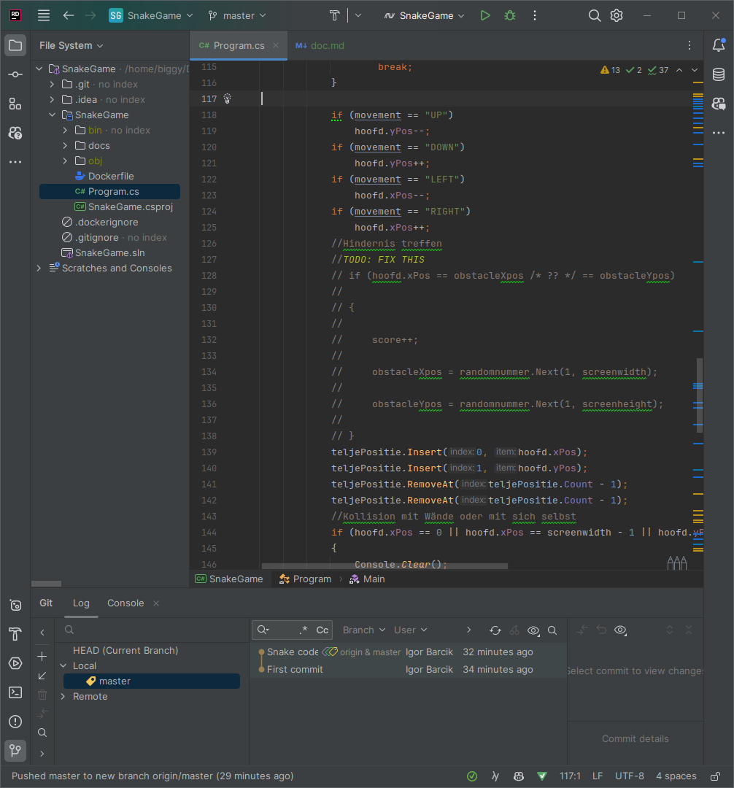
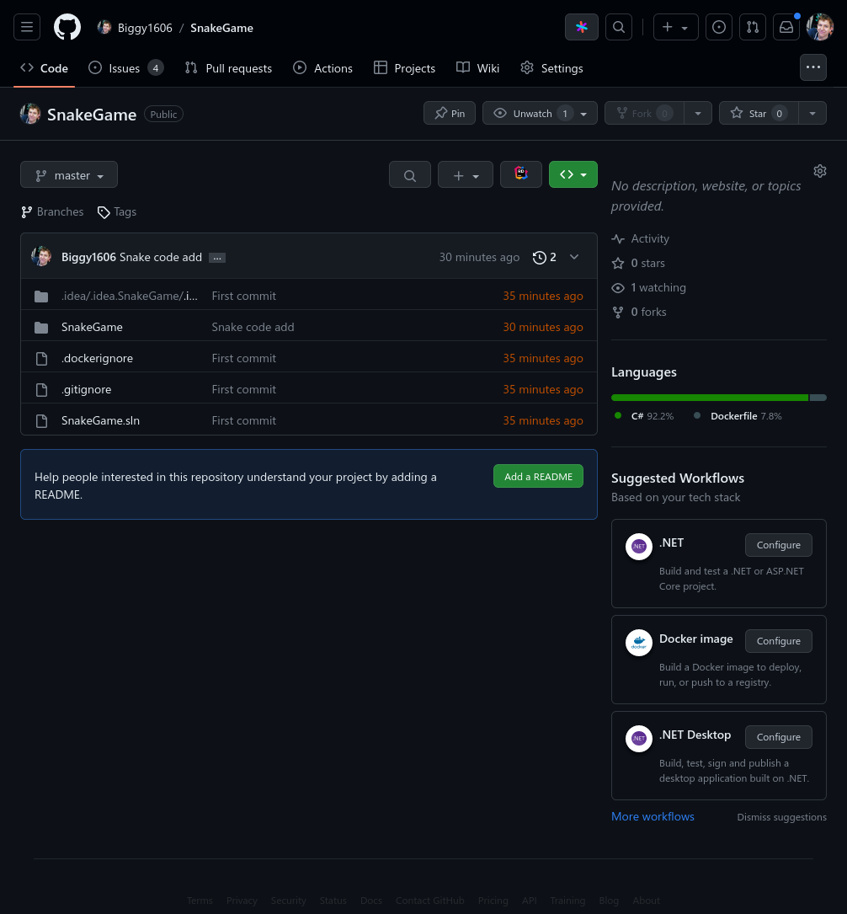
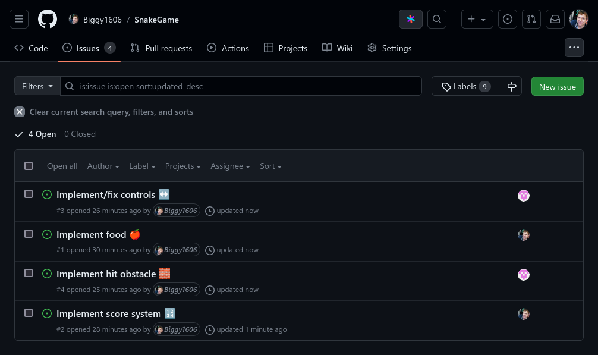
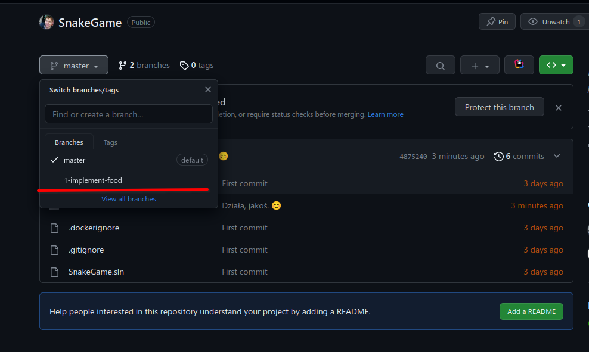
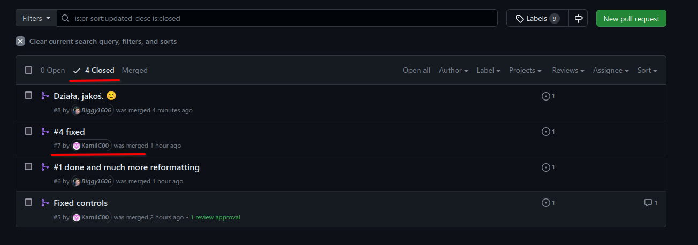
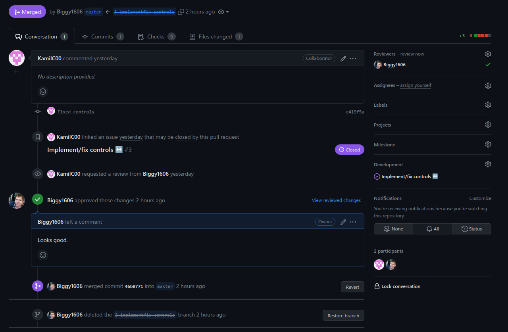
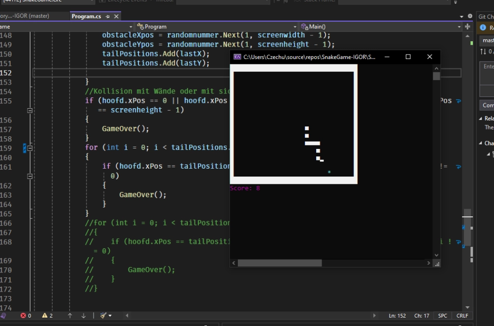

# lab4 - SnakeGame

<https://github.com/Biggy1606/SnakeGame>

1. Tworzenie Projektu:
        Utwórz nowy projekt C# w środowisku Visual Studio (lub wybranym przez Ciebie edytorze kodu).
        Zaimplementuj prostą grę Snake w konsoli.
        

2. Inicjowanie Repozytorium na GitHub:
        Utwórz nowe repozytorium na GitHub o nazwie "SnakeGame".
        Skonfiguruj lokalne repozytorium i połącz je z repozytorium na GitHub.
        

3. Podział Zadań:
        Podziel projekt na mniejsze zadania, takie jak implementacja ruchu węża, obsługa klawiszy, jedzenie, punktacja itp.
        Przypisz poszczególne zadania do różnych uczestników.
        

4. Tworzenie Oddzielnych Gałęzi:
        Każdy uczestnik powinien utworzyć swoją oddzielną gałąź w repozytorium na GitHub do realizacji swojego zadania.
        

5. Kodowanie i Wysyłanie Zgłoszeń Zmian:
        Każdy uczestnik implementuje swoje zadanie w swojej gałęzi.
        Po zakończeniu zadania, wysyła zgłoszenie zmian (merge request) do gałęzi głównej repozytorium.
        

6. Recenzja i Zatwierdzenie Zmian:
        Pozostali uczestnicy przeglądają zgłoszenia zmian innych osób.
        Dodają komentarze i sugestie w przypadku potrzeby.
        Kiedy zgłoszenie zmian zostanie zaakceptowane przez innych, dokonuje się scalenia zmian do gałęzi głównej.
        
7. Testowanie i Poprawki:
        Po scaleniu zmian, wszyscy uczestnicy testują grę, aby upewnić się, że nowe funkcje nie wprowadziły błędów.
        W razie potrzeby, wprowadzają poprawki i ponownie wysyłają zgłoszenia zmian.
        

8. Współpraca na Konsoli:
        Dodaj funkcje komunikacji na konsoli, tak aby wąż reagował na ruchy innych węży (graczy).
        Każdy uczestnik odpowiada za jedną funkcję współpracy.

9. Rozwiązanie Problemów (Issues):
        Utwórz nowe "issue" na GitHub dotyczące jakiegoś problemu lub pomysłu na rozwinięcie gry.
        Przypisz issue do siebie i rozwiąż problem, tworząc nową gałąź i zgłoszenie zmian.

10. Aktualizacja Dokumentacji:
        Dodaj do projektu prostą dokumentację, opisującą funkcje gry, zasady współpracy oraz instrukcje uruchamiania.
